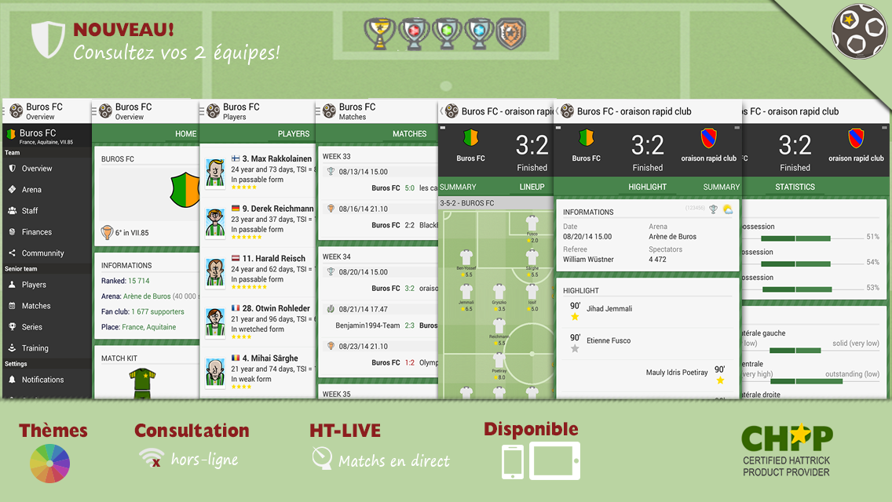
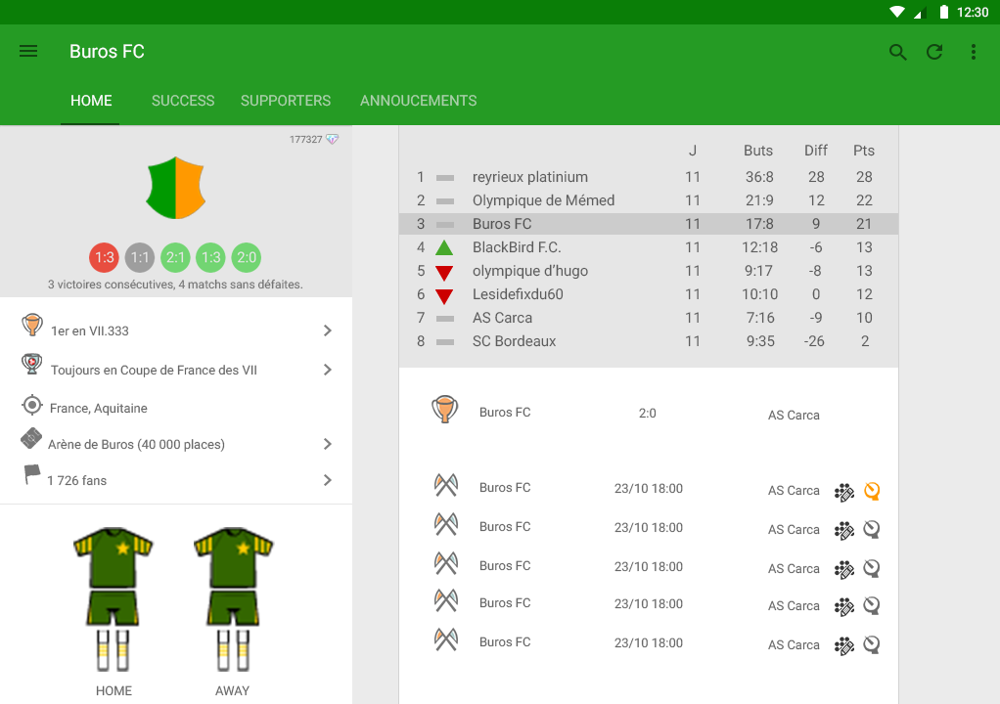

# Hattrick Scoreboard 

Hattrick Scoreboard is the modern application to follow your [Hattrick](http://www.hattrick.org) club. 

## Official presentation 

Hattrick Scoreboard is the modern application to follow your club. You can read a lot of information for your team in this modern application also suitable for tablets.

The features at a glance:

★ Club: support 2 teams (Supporter functionality)  
★ Information: club, stadium employees and finances  
★ Matches: schedule and standings  
★ Players: skills and statistics  
★ HT-Live: All your games (and those you follow) on live!  
★ Match: Summary, lineup  and statistics  
★ New: See also information from other clubs!  

and also:  
• Customizable Colors  
• Notifications for matches (goals, cards, injuries ...)  

In development:
- Transfers and supporters
- More information about the teams
- Information on youth teams
- Pass the match orders (Supporter functionality)

► Hattrick Scoreboard search testers and/or translators, if you want to participate, write to the manager khips on Hattrick!

[Hattrick Scoreboard CHPP](http://www.hattrick.org/Community/CHPP/ChppProgramDetails.aspx?ApplicationId=4726) provides access to a wealth of information for your team. All in a **modern application** also suitable for **tablets** and offers some features **offline** !

## About source code

After the new official app of the game, and for lack of time, I decided to stop publish the application. I then decided to open source the application to the community why not revive the project and / or facilitate new projects.

## Hattrick Scoreboard L

> Preview of the application for tablet with Android L (Lollipop) theme.

> **Warning**
> 
>Because [Hattrick](http://www.hattrick.org) uses a public / private key system to authenticate CHPP applications and  developers, **I voluntarily removed my own key**. You should ask your key to build your application.
>
> **MIT License**
> <i>"...THE SOFTWARE IS PROVIDED "AS IS", WITHOUT WARRANTY OF ANY KIND..."</i>
>
> **Note**
> - The application contains many bugs, feel free to suggest a correction ;-)
> - A wiki will be set up soon ...
> - A branch that I had started to develop will be pushed soon. The application takes Material Design and brings some major changes.

